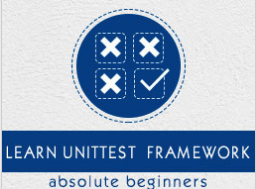

```
Roberto Nogueira  
BSd EE, MSd CE
Solution Integrator Experienced - Certified by Ericsson
```
# TutorialsPoint Pytest



**About**

It was in 2004 that Holger Krekel renamed his std package, whose name was often confused with that of the Standard Library that ships with Python, to the (only slightly less confusing) name 'py.' Though the package contains several sub-packages, it is now known almost entirely for its `py.test` framework.

The `py.test` framework has set up a new standard for Python testing, and has become very popular with many developers today. The elegant and Pythonic idioms it introduced for test writing have made it possible for test suites to be written in a far more compact style.

`py.test` is a no-boilerplate alternative to Python’s standard unittest module. Despite being a fully-featured and extensible test tool, it boasts of a simple syntax. Creating a test suite is as easy as writing a module with a couple of functions.

`py.test` runs on all POSIX operating systems and WINDOWS (XP/7/8) with Python versions 2.6 and above.

[Homepage](https://www.tutorialspoint.com/unittest_framework/unittest_framework_py_test_module.htm)

## Topics
```
UnitTest Framework Tutorial
[x] Home
[x] Overview
[x] Framework
[ ] API
[ ] Assertion
[ ] Test Discovery
[ ] Skip Test
[ ] Exceptions Test
[ ] Time Test
[ ] Unittest2
[ ] Signal Handling
[ ] Doctest
[ ] Doctest API
[ ] Py.test Module
[ ] Nose Testing - Framework
[ ] Nose Testing - Tools
UnitTest Framework Resources
[ ] Quick Guide
[ ] Resources
[ ] Discussion
Selected Reading
[ ] Developer's Best Practices
[ ] Questions and Answers
[ ] Effective Resume Writing
[ ] HR Interview Questions
[ ] Computer Glossary
[ ] Who is Who
```
